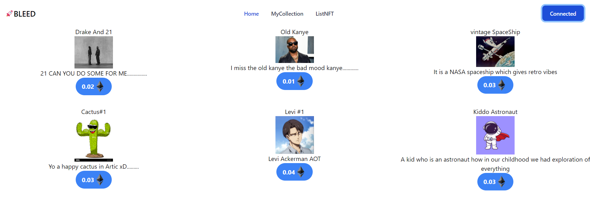

NFT MARKETPLACE

It is NFT marketplace where prople can buy and sell NFT   
So the website has 3 pages 
->Home page where all trading of NFT takesplace 
->List NFT its the place where you cretae and list your NFT
->My Collection it will show your NFTs

Technology Used
Backend:
    -Hadhat to deploy and verify the contract
    -smart contract written in solidity
    -for the frontend part i have used REACT JS and EtherJS
    -tailwind CSS
    -Filecoin WEB3STORAGE

Why used the above technology->Hardhat makes the deployment and the compilation process so much easier and react makes it easy for the UI part and ethersJS makes it faster and easier to communicate with the smartcontract and have used Web3storage for storing the metadata on IPFS which is the most easiest way of storing the data on IPFS and i have used polygon mumbai testnet to deploy the contract and alchemy for node management endpoint

Commands used in the Project
npx --save-dev hardhat to install hardhat
npm hardhat compile 
npx hardhat run scripts/deploy.js --network polygon_mumbai
npm install --save-dev @chainlink/contracts
npx hardhat verify --network <network> <contract address> <constructor parameters>

npx create-react-app app_name

